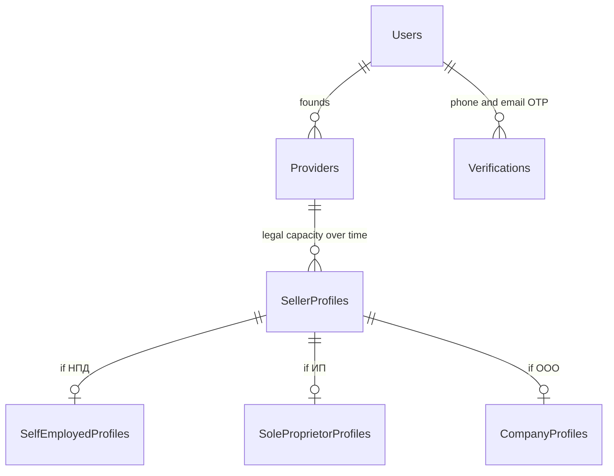

# Seller Onboarding — Full Redesign (PROPOSAL)

> Status: **proposed, not implemented.** Captured from the 2026-09-22 discussion. Replaces
> `ProviderOnboardingApplication` entirely and **builds on**
> [provider-moderation-model.design.md](provider-moderation-model.design.md), whose
> *register-first, publish-after-review* principle and `ProviderModerationState` enum both stand.
>
> Contains claims about Russian tax law that need a tax advisor's confirmation before they are
> built. They are marked ⚠️.

## Why the current model has to go

`ProviderOnboardingApplication` is **38 columns, 27 of them nullable**, holding four unrelated
things in one row:

| Concern | Columns | Problem |
|---|---|---|
| Provider identity | `DisplayName`, `LegalName`, `Description`, `Address` | copied onto `Provider` at approval, then duplicated forever |
| Legal identity | `LegalForm`, `TaxationSystem`, `TaxNumber`, `RegistrationNumber`, `BranchNumber`, `ChiefExecutive*` ×5 | only some apply to any given seller |
| Payout instructions | `Payout*` ×9 | belongs to `ProviderPayoutContract`, which also exists |
| Review workflow | `Status`, `ReviewReasonCode`, `ReviewMessage`, `ReviewActorUserId`, `SubmittedAt`, `ReviewedAt` | a state machine wedged into a form |

Those 27 nullable columns are not laziness — they are the model admitting that **requirements
depend on who the seller is**, without having a way to express it. An ООО needs `Kpp` and a
director; a самозанятый needs neither, and nothing in the schema says so.

Three further defects:

- **It is a one-shot artifact.** Approved once, then dead — but sellers change. A самозанятый
  who becomes an ИП has no way to re-verify without a second application competing with the
  first for ownership of the same provider.
- **It owns data it should only collect.** `ProviderProfileService` reads the application at
  runtime, so a dead form stays load-bearing.
- **Approval is a constructor.** The `Provider` row is created inside `ApproveOnboardingAsync`,
  which is the defect [provider-moderation-model.design.md](provider-moderation-model.design.md)
  already documents.

## Correcting the C2C / B2C framing

The premise — *tours and experiences are C2C, rental is B2C* — is half right, and the half that
is wrong matters, because building on it would bake a restriction into the schema.

**C2C-vs-B2C is a property of the seller's legal capacity, not of the offer type.**

|  | Sells rental | Sells tours |
|---|---|---|
| **Самозанятый** | a person renting out their own SUP | a guide running weekend trips |
| **ИП / ООО** | a rental shop | a tour operator |

All four quadrants are real businesses. The correlation the premise notices is genuine — guides
tend to be individuals, rental shops tend to be companies — but it is a correlation, not a
constraint. Coupling them would stop a tour operator from renting out gear and stop a
самозанятый from listing a rental, both of which are ordinary.

So: **two independent axes.** Offer type decides fulfillment (see
[fulfillment-dimensions.design.md](fulfillment-dimensions.design.md)). Seller kind decides legal
capacity, documents, receipts and payouts. Neither determines the other.

## The seller kinds

The proposal lists "physical seller" as a kind. In Russia that needs one correction: a private
person cannot receive systematic business income without a tax status. So there are three
**legal** kinds, and "physical person" is the *entry path* to the first of them.

| Kind | Enum today | Identity | Receipt (чек) | Payout target |
|---|---|---|---|---|
| **Самозанятый** (НПД) | `SelfEmployed` | passport, ИНН, НПД status | «Мой налог», API-registerable by a partner platform | personal card / СБП |
| **ИП** | `SoleProprietor` | ИНН, ОГРНИП, ЕГРИП extract | own kassa, or platform as agent | business account |
| **Организация** | `Company` | ИНН, КПП, ОГРН, ЕГРЮЛ, director | own kassa, or platform as agent | business account |

### Decisions taken

- **Payout route is derived from seller kind, not configured.** Самозанятый is paid by **SBP to
  a phone number**; ИП and ООО are paid through a **T-Bank multisplit shop**. Self-employed
  sellers are never registered as multisplit shops. Both paths already exist in the schema —
  `ProviderPayoutContractSbpPayouts` (phone + `SbpMemberId`) and `ProviderTBankShops` +
  `ProviderPayoutContractBankRequisites` — so this makes an existing choice automatic rather
  than adding anything.
- **The НПД income ceiling is not the platform's concern.** We only ever see income earned
  through us, never the seller's total, so any cap we tracked would be wrong in the direction
  that matters. Not modelled, not warned on.

### The constraint that remains

⚠️ **Can a самозанятый hold rental offers?** НПД covers own services, own-produced goods and
property rights, not the resale of purchased goods. Renting out one's own equipment is
generally treated as a service; running a shop on purchased stock is not. This decides whether
`sell_rental` is restricted by seller kind, and it still needs a tax advisor.

## The model

Verification here is **synchronous and authoritative**, which makes the model much smaller than
it first appears:

- **ИНН and legal data** come from Dadata. The seller types an ИНН; we fetch ЕГРЮЛ/ЕГРИП and
  store what the registry returned. There is no "claimed" version to reconcile against a
  "verified" one — there is only the authoritative record.
- **Phone and email** are proved by OTP, using the `Verifications` table that already exists.

So nothing is ever stored in an unverified state, and **a verification-claims table would record
only one value: true.** An earlier draft of this document proposed `VerifiedFact`,
`ProviderRequirement` and `ProviderCapability` tables modelled on Stripe Connect. That was the
wrong import: Stripe needs them because it verifies asynchronously, across many jurisdictions,
against requirements that change underneath existing accounts. None of that applies here.

What remains is three things:



### 1. `Provider` — the stable business identity

Name, slug, reputation, offers, operating state. **Created at registration**, not at approval.
It never changes when the legal form does: a самозанятый who incorporates keeps their listings,
reviews and history, because the business is the same business.

### 2. `SellerProfile` — a typed hierarchy, versioned

The kinds form a real inheritance hierarchy, and the split that matters is the payout route:

```
SellerProfile            (abstract)  ProviderId, EffectiveFrom, EffectiveTo
├── SelfEmployedProfile              Inn, NpdRegisteredAt        → SBP by phone
└── BusinessProfile      (abstract)  Inn, TaxationSystem, KassaRef → multisplit shop
    ├── SoleProprietorProfile        Ogrnip, RegisteredAt
    └── CompanyProfile               Kpp, Ogrn, LegalName, LegalAddress, Director*
```

**Table-per-type, not table-per-hierarchy.** TPH would put every kind in one table with the
subtype columns nullable — which is precisely the 27-nullable-column problem this redesign
exists to remove. Under TPT each table holds only what applies to it, so every column is
`NOT NULL` by construction and the database rejects an ООО with no ОГРН rather than trusting a
service to check.

The intermediate `BusinessProfile` earns its place: ИП and ООО share ИНН, taxation system,
kassa and the multisplit payout route, and differ only in registration identity. Putting the
shared set there keeps it non-nullable for both and keeps the payout decision at one level.

### Why the hierarchy is on the profile, not on `Provider`

It is tempting to make `Provider` itself the base class — `SelfEmployedSeller : Seller`,
`CompanySeller : Seller` — and skip a table. That breaks on the case the whole redesign is for.

**EF Core cannot change an entity's type in place.** A самозанятый who incorporates would need
their row deleted and re-inserted as a different type, taking a new primary key with it — and
every offer, booking, invoice, review and payout that references them would have to be
re-pointed. A legal-form change would become a data migration.

Keeping identity untyped and the *profile* typed makes the same change a single `INSERT`: close
the old profile with `EffectiveTo`, open a new one. Identity, listings, reputation and payment
history are untouched because they never referenced the type in the first place.

This is also why profiles are versioned rather than edited. Last year's payouts should still
resolve to the entity that legally earned them.

### Serving it: one polymorphic contract

At the API boundary the hierarchy surfaces as a discriminated union, with `kind` as the
discriminator — `System.Text.Json` handles this natively via `[JsonPolymorphic]` and
`[JsonDerivedType]`, so it needs no hand-written converter:

```json
{
  "kind": "company",
  "inn": "7707083893",
  "taxation_system": "usn",
  "kpp": "770701001",
  "ogrn": "1027700132195",
  "legal_name": "ООО «Пример»",
  "director": { "first_name": "…", "last_name": "…" }
}
```

A client switches on `kind` and gets fields that are actually present, rather than a flat object
where two thirds of the keys are `null` and which ones depend on a value elsewhere in the
payload.

### 3. Moderation — one state on `Provider`, not a table

Dadata confirms the business *exists*. It cannot say whether we want to trade with it, and that
judgment is the only thing left that a human makes. It is a single state, restoring the enum
from [provider-moderation-model.design.md](provider-moderation-model.design.md):

`Unsubmitted → PendingReview → Approved | ChangesRequested | Rejected`

with the reviewing actor, timestamp and reason alongside it. One row's worth of information, so
one row.

### 4. Capability — a predicate, not a table

What a seller may do is derivable in full from what is already stored, so it should be computed
rather than persisted — the same reasoning that keeps offer visibility computed:

```
can_list(provider)     == provider.Moderation != Rejected
can_sell(provider)     == provider.Moderation == Approved
                       && provider.Operating  == Active
                       && current SellerProfile exists
can_be_paid(provider)  == can_sell(provider) && payout route configured for the profile kind
can_sell_rental(p)     == can_sell(p) && (profile is BusinessProfile || ⚠️ self-employed allowed)
```

A stored capability is a cache that is wrong the moment a profile is superseded or a provider is
suspended. The console renders the missing pieces from the same predicate — "no profile yet",
"awaiting review", "payout details missing" — which is the checklist, without a requirements
table to keep in step.

## What each kind must supply

One table, not three code paths. Everything in it is verified at the moment of entry, so a
stored profile is a complete and confirmed one by definition.

| | Самозанятый | ИП | ООО |
|---|---|---|---|
| Phone | OTP (already done at sign-in) | OTP | OTP |
| Email | OTP, optional | OTP, optional | OTP, optional |
| ИНН | typed, checked against Dadata | typed → ЕГРИП fetched | typed → ЕГРЮЛ fetched |
| Legal data | — | ОГРНИП, registration date, from Dadata | КПП, ОГРН, legal name and address, director, from Dadata |
| Payout | SBP phone + `SbpMemberId` | bank account + БИК → multisplit shop | bank account + БИК → multisplit shop |
| Review | admin verdict | admin verdict | admin verdict |

Two consequences worth stating: the seller **types only an ИНН and a phone** — everything else
about a company is fetched, so there is nothing to mistype and nothing to cross-check. And
adding a kind means adding a row here and a table under `SellerProfile`, not a branch in an
onboarding service.

## What this gives that the current model cannot

- **Register instantly, sell progressively.** A seller lists on a verified phone alone, and each
  further fact unlocks more. No approval wall, which is the principle the moderation design
  already argued for.
- **Evolution without re-application.** Becoming an ИП is a new `SellerProfile` row and a few
  new facts. Listings, reviews and history are untouched.
- **Requirements that can change.** If the law adds a document, one requirement row updates and
  everyone's `eventually_due` reflects it — no migration, no re-onboarding campaign.
- **An audit trail by construction.** Append-only facts answer "why was this seller allowed to
  trade on that date?" years later, which a mutable 38-column form cannot.
- **Honest NOT NULL constraints**, because requirements live per kind.

## Migration

`ProviderOnboardingApplication` decomposes cleanly — every column has a destination:

| From | To |
|---|---|
| `DisplayName`, `LegalName`, `Description`, `Address` | `Provider` (already copied there) |
| `LegalForm` | `SellerProfile.Kind` |
| `TaxNumber`, `RegistrationNumber`, `BranchNumber`, `TaxationSystem`, `ChiefExecutive*` | the matching kind profile table |
| `Payout*` ×9 | `ProviderPayoutContract` (already exists) |
| `Status`, `Review*`, `SubmittedAt`, `ReviewedAt` | `Provider.ModerationState` + review actor, timestamp and reason |

1. Build the new tables alongside; change nothing.
2. Backfill: every existing provider gets a `SellerProfile` of its recorded form and the
   matching kind profile, populated from the application and re-checked against Dadata where
   the ИНН allows it. Existing providers are `Approved` — they were trading already.
3. Assert the capability predicate says every existing provider may still trade. A pure check,
   no behaviour change.
4. Move provider creation to registration; new sellers start with zero facts.
5. Point reads at the new model, drop `ProviderOnboardingApplication`.

Steps 1–3 are invisible in production. Step 4 is the only behavioural change, and by then it is
the only one left.

## Open decisions

1. ⚠️ **Can a самозанятый hold rental offers?** Decides whether `can_sell_rental` is restricted
   by kind. Needs a tax advisor, and it is the only blocking unknown left.
2. **Do we register чеки on sellers' behalf?** Acting as agent is a much better seller
   experience and a much larger compliance surface.
3. **Do we facilitate НПД registration inside onboarding?** ФНС offers partner registration,
   which converts "I am not a business" into "I am" without leaving the product.
4. **Does a legal-form change re-open review?** Per the moderation design: keep selling, flag
   the case, let an admin suspend explicitly.
5. **Is `Verifications` reused for seller contact details, or is the sign-in phone enough?**
   Phone-first auth means the founder's phone is already proved; a separate *business* contact
   phone would need a new `VerificationPurposeType`.

## Related

- [provider-moderation-model.design.md](provider-moderation-model.design.md) — register-first principle; its state enum is absorbed here
- [fulfillment-dimensions.design.md](fulfillment-dimensions.design.md) — the independent offer-type axis
- [billing-and-payout-model.design.md](billing-and-payout-model.design.md) — where payout instructions belong
- [database-model.md](database-model.md) — current schema and its defects
