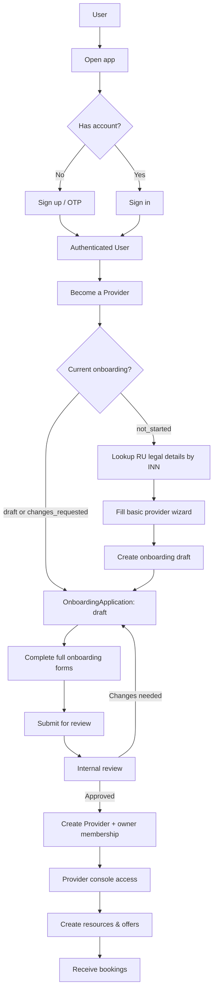
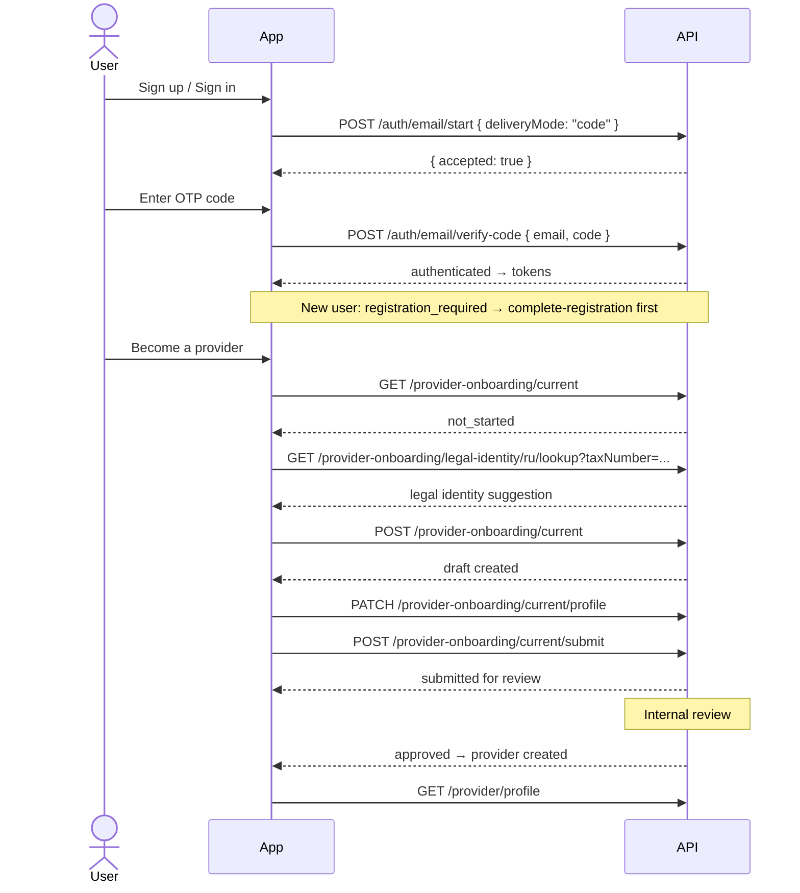

# Sign-In & Provider Onboarding Flow

```mermaid
flowchart TD
    U[User] --> A[Open app]
    A --> B{Has account?}
    B -->|No| C[Sign up / OTP]
    B -->|Yes| D[Sign in]
    C --> F[Authenticated User]
    D --> F

    F --> G[Become a Provider]
    G --> CO{Current onboarding?}
    CO -->|not_started| T[Lookup RU legal details by INN]
    T --> H[Fill basic provider wizard]
    H --> I[Create onboarding draft]
    CO -->|draft or changes_requested| J

    I --> J[OnboardingApplication: draft]
    J --> L[Complete full onboarding forms]
    L --> M[Submit for review]
    M --> N[Internal review]
    N -->|Changes needed| J
    N -->|Approved| O[Create Provider + owner membership]
    O --> Q[Provider console access]
    Q --> R[Create resources & offers]
    R --> S[Receive bookings]
```

```mermaid
sequenceDiagram
    actor User
    participant App
    participant API

    User->>App: Sign up / Sign in
    App->>API: POST /auth/email/start { deliveryMode: "code" }
    API-->>App: { accepted: true }
    User->>App: Enter OTP code
    App->>API: POST /auth/email/verify-code { email, code }
    API-->>App: authenticated → tokens
    Note over App,API: New user: registration_required → complete-registration first

    User->>App: Become a provider
    App->>API: GET /provider-onboarding/current
    API-->>App: not_started
    App->>API: GET /provider-onboarding/legal-identity/ru/lookup?taxNumber=...
    API-->>App: legal identity suggestion
    App->>API: POST /provider-onboarding/current
    API-->>App: draft created
    App->>API: PATCH /provider-onboarding/current/profile
    App->>API: POST /provider-onboarding/current/submit
    API-->>App: submitted for review
    Note over API: Internal review
    API-->>App: approved → provider created
    App->>API: GET /provider/profile
```
