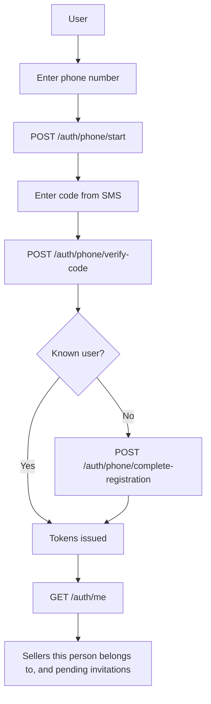
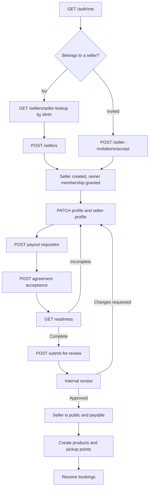

# Sign-In And Seller Onboarding Flow

Rewritten 2026-09-30. The previous version drew an `OnboardingApplication` that a review turned into
a provider, over `/provider-onboarding/*` routes and an email OTP sign-in. None of that exists: the
phone is the identity, the seller is created first, and review gates publishing rather than creation.

## Signing in

The phone number is the identity and the only way in. Email is a contact that can be attached
afterwards, never a way to sign in.

A trusted device may then sign in with a passcode instead of an SMS code, via
`/auth/passcode/sign-in`.

## Becoming a seller

Register first, publish after review. The seller row exists as soon as it is created, so the console
is usable immediately; what review gates is being visible to customers and being paid.

`GET /sellers/{sellerId}/readiness` is the console's checklist: it says what is still missing and
whether the seller can submit, be published, and be paid. It computes from facts rather than storing
a state.

## Where the details are

The routes above are abbreviated; the full contract is in
[`../api/openapi/seller.json`](../api/openapi/seller.json). The decisions behind the flow are in
[`../phone-first-auth.design.md`](../phone-first-auth.design.md) and
[`../seller-onboarding-redesign.design.md`](../seller-onboarding-redesign.design.md).
