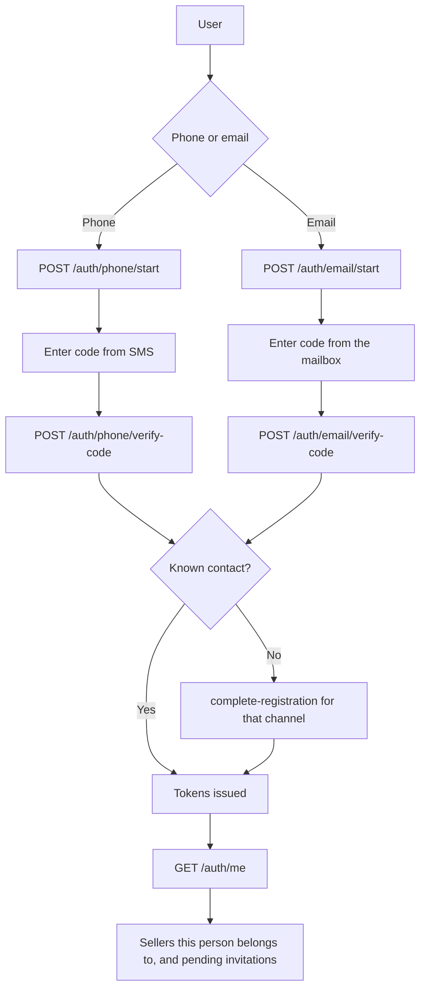
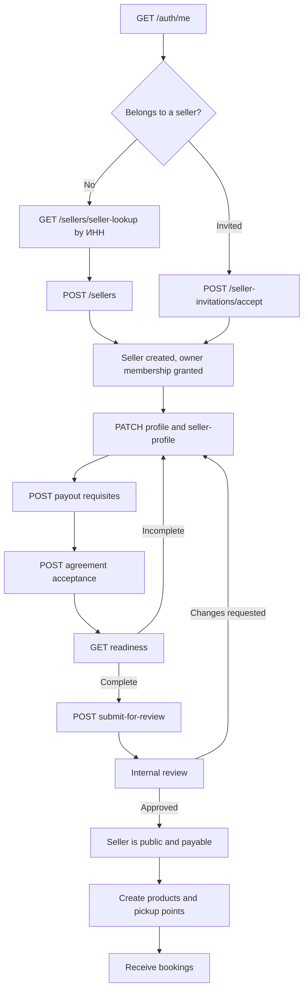

# Sign-In And Seller Onboarding Flow

Rewritten 2026-09-30. The previous version drew an `OnboardingApplication` that a review turned into
a provider, over `/provider-onboarding/*` routes and an email OTP sign-in. None of that exists: the
phone is the identity, the seller is created first, and review gates publishing rather than creation.

## Signing in

The phone number and the email address are both credentials. Whichever one someone joined with, they
can add the other from inside their session and then sign in with either — see
[`../two-ways-in-auth.design.md`](../two-ways-in-auth.design.md).

A trusted device may then sign in with a passcode instead of a code, via `/auth/passcode/sign-in`.

The second contact is added from inside the session and proved the same way: `attach/start` then
`attach/confirm`, on `/auth/phone/` or `/auth/email/`.

## Becoming a seller

Register first, publish after review. The seller row exists as soon as it is created, so the console
is usable immediately; what review gates is being visible to customers and being paid.

`GET /sellers/{sellerId}/readiness` is the console's checklist: it says what is still missing and
whether the seller can submit, be published, and be paid. It computes from facts rather than storing
a state.

## Where the details are

The routes above are abbreviated; the full contract is in
[`../api/openapi/seller.json`](../api/openapi/seller.json). The decisions behind the flow are in
[`../phone-first-auth.design.md`](../phone-first-auth.design.md) and
[`../seller-onboarding-redesign.design.md`](../seller-onboarding-redesign.design.md).
